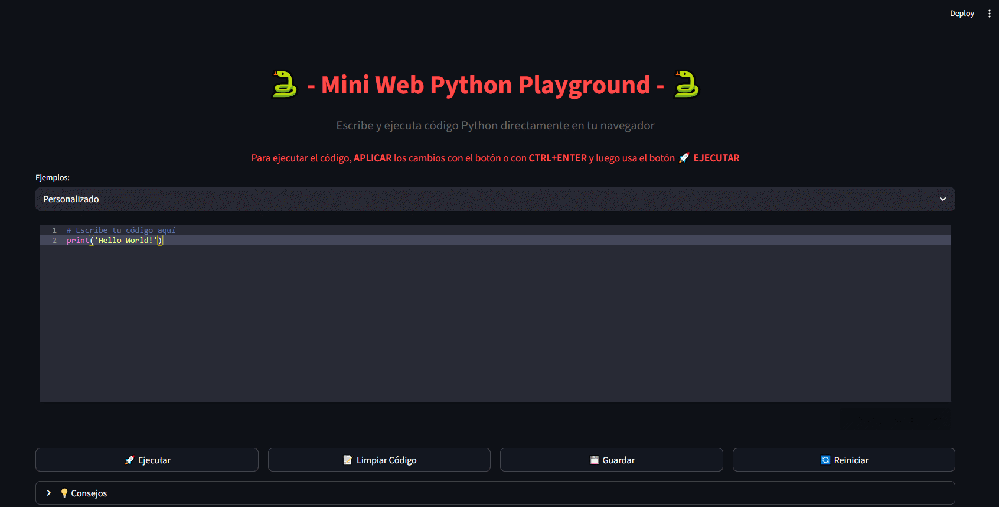

# 🐍 Mini Web Python Playground


Una aplicación web interactiva construida con Streamlit que permite escribir, ejecutar y probar código Python directamente desde tu navegador. Perfecto para aprender Python, hacer pruebas rápidas o enseñar programación.

<div align="center">
    
  <p>Detalle de la Interfaz</p>
</div>

## ✨ Características Principales

### 🚀 Ejecución en Tiempo Real
- **Ejecución segura**: Código ejecutado en un entorno temporal y controlado
- **Resultados inmediatos**: Ve la salida de tu código instantáneamente
- **Manejo de errores**: Feedback detallado cuando ocurren errores

### 📝 Editor Avanzado
- **Resaltado de sintaxis**: Código más legible con colores y formato
- **Autocompletado**: Soporte para linting e IntelliSense mediante Streamlit Ace
- **Múltiples temas**: Incluye tema Dracula y otros temas populares

### 🎯 Ejemplos Integrados
- **Ejemplos prácticos**: Desde código básico hasta visualizaciones con Matplotlib
- **Categorías organizadas**: Básico, Listas, Funciones, Gráficos
- **Fácil acceso**: Selector desplegable para cambiar entre ejemplos

### 💾 Gestión de Código
- **Guardar código**: Descarga tu código como archivo `.py`
- **Limpiar editor**: Restablece el editor con un solo clic
- **Reiniciar ejemplos**: Vuelve al código inicial en cualquier momento

## 🛠️ Tecnologías Utilizadas

- **Streamlit** - Framework para aplicaciones web en Python
- **Streamlit Ace** - Editor de código avanzado en el navegador
- **Matplotlib** - Visualizaciones y gráficos
- **NumPy** - Cálculos numéricos y científicos
- **Tempfile** - Ejecución segura de código en archivos temporales

## 🚀 Instalación y Uso

### Prerrequisitos
- Python 3.7 o superior
- pip (gestor de paquetes de Python)

### 📥 Instalación Local

#### 1. Clonar el repositorio
```bash
git clone https://github.com/Charran78/python-playground.git
cd python-playground
```

#### 2. Crear y activar entorno virtual (Recomendado)
```bash
# Crear entorno virtual
python -m venv venv

# Activar en Windows
venv\Scripts\activate

# Activar en macOS/Linux
source venv/bin/activate
```

#### 3. Instalar dependencias
```bash
# Instalar desde requirements.txt
pip install -r requirements.txt
```

#### 4. Ejecutar la aplicación
```bash
streamlit run app.py
```

#### 5. Abrir en el navegador
La aplicación se abrirá automáticamente en:
```
http://localhost:8501
```

### 🌐 Uso Online
La aplicación está diseñada para ejecutarse en plataformas de hosting que soporten Streamlit como:
- Streamlit Community Cloud
- Heroku
- Railway
- Hugging Face Spaces

## 📁 Estructura del Proyecto

```
python-playground/
│
├── app.py                 # Aplicación principal de Streamlit
├── requirements.txt       # Dependencias del proyecto
├── README.md             # Documentación del proyecto
└── .gitignore           # Archivos ignorados por Git
```

## 📋 requirements.txt

```txt
streamlit>=1.28.0
streamlit-ace>=0.1.1
matplotlib>=3.7.0
numpy>=1.24.0
```

## 📖 Cómo Usar

### 1. Escribir Código
- Usa el editor principal para escribir tu código Python
- Aplica los cambios con `Ctrl+Enter` o el botón de aplicar
- El editor incluye resaltado de sintaxis y sugerencias

### 2. Ejecutar Código
- Haz clic en el botón **🚀 Ejecutar**
- Ve los resultados en la sección de salida
- Revisa los errores en la sección de advertencias si es necesario

### 3. Explorar Ejemplos
- Usa el selector desplegable para cargar ejemplos predefinidos
- Desde código básico hasta visualizaciones con Matplotlib
- Perfecto para aprender diferentes conceptos de Python

### 4. Gestionar tu Código
- **💾 Guardar**: Descarga tu código como archivo Python
- **📝 Limpiar**: Borra el editor y empieza desde cero
- **🔄 Reiniciar**: Vuelve a los ejemplos iniciales

## 🔧 Desarrollo

### Para contribuir al proyecto:

1. **Fork el repositorio**
2. **Crea una rama de feature**:
   ```bash
   git checkout -b feature/nueva-caracteristica
   ```
3. **Instala en modo desarrollo**:
   ```bash
   pip install -r requirements.txt
   ```
4. **Haz tus cambios y prueba**:
   ```bash
   streamlit run app.py
   ```
5. **Commit y push**:
   ```bash
   git commit -m "Añadir nueva característica"
   git push origin feature/nueva-caracteristica
   ```
6. **Crea un Pull Request**

### Dependencias principales:
- `streamlit`: Framework web principal
- `streamlit-ace`: Editor de código avanzado
- `matplotlib`: Generación de gráficos
- `numpy`: Operaciones matemáticas

## 🐛 Solución de Problemas

### Error: Módulo no encontrado
```bash
# Si falta algún módulo, instálalo manualmente:
pip install nombre-del-modulo

# O reinstala todas las dependencias
pip install -r requirements.txt
```

### Error: Puerto ya en uso
```bash
# Usar un puerto diferente
streamlit run app.py --server.port 8502
```

### Error: Entorno virtual no se activa
```bash
# En PowerShell Windows, puede necesitar:
Set-ExecutionPolicy -ExecutionPolicy RemoteSigned -Scope CurrentUser

# En Windows Command Prompt:
venv\Scripts\activate.bat
```

### Error: Streamlit Ace no se instala
```bash
# Instalar desde PyPI
pip install streamlit-ace

# O instalar la última versión desde GitHub
pip install git+https://github.com/okld/streamlit-ace.git
```

## 🎨 Características Técnicas

### Seguridad
- Ejecución en entorno temporal
- Timeout automático para código largo
- Aislamiento de procesos

### Compatibilidad
- Soporte para librerías populares: NumPy, Pandas, Matplotlib
- Compatible con la mayoría de la biblioteca estándar de Python
- Funciona en todos los navegadores modernos

### Experiencia de Usuario
- Interfaz responsive y moderna
- Navegación intuitiva
- Feedback visual inmediato

## 📊 Ejemplos Incluidos

### 🔹 Básico
Introducción a Python con print, variables y funciones simples.
```python
print("Hello Python World!")
numbers = [1, 2, 3, 4, 5]
for num in numbers:
    print(f"Number: {num}")
```

### 🔹 Listas
Manipulación de listas, iteración y comprensión de listas.
```python
fruits = ["apple", "banana", "orange"]
squares = [x**2 for x in range(1, 6)]
```

### 🔹 Funciones
Definición y uso de funciones, condicionales y bucles.
```python
def is_even(number):
    return number % 2 == 0
```

### 🔹 Matplotlib
Creación de gráficos y visualizaciones básicas.
```python
import matplotlib.pyplot as plt
import numpy as np
x = np.linspace(0, 10, 100)
y = np.sin(x)
plt.plot(x, y)
```

## 🤝 Contribuciones

¡Las contribuciones son bienvenidas! Si quieres mejorar este proyecto:

1. Haz fork del proyecto
2. Crea una rama para tu feature (`git checkout -b feature/AmazingFeature`)
3. Commit tus cambios (`git commit -m 'Add some AmazingFeature'`)
4. Push a la rama (`git push origin feature/AmazingFeature`)
5. Abre un Pull Request

## 📝 Licencia

Este proyecto está bajo la Licencia MIT - ver el archivo [LICENSE](LICENSE) para más detalles.

## 👨‍💻 Autor

**Pedro Mencías**

- 💼 LinkedIn: [Pedro Mencías](https://www.linkedin.com/in/pedro-menc%C3%ADas-68223336b/)
- 💻 GitHub: [@Charran78](https://github.com/Charran78)
- 🌐 Portfolio: [pedromencias.netlify.app](https://pedromencias.netlify.app/)
- ☕ Buy Me a Coffee: [@beyonddigiv](https://buymeacoffee.com/beyonddigiv)

## 🙏 Agradecimientos

- [Streamlit](https://streamlit.io/) por el increíble framework
- [Streamlit Ace](https://github.com/okld/streamlit-ace) por el editor de código
- [Gemini 2.5 Flash](https://gemini.google.com) por la ayuda inestimable.
- La comunidad de Python por las librerías y herramientas
- Todos los contribuidores y usuarios del proyecto

## 📞 Soporte

Si encuentras algún problema o tienes alguna pregunta:

1. Revisa la sección de [Solución de Problemas](#-solución-de-problemas)
2. Abre un [issue](https://github.com/Charran78/python-playground/issues) en GitHub
3. Contáctame a través de [LinkedIn](https://www.linkedin.com/in/pedro-menc%C3%ADas-68223336b/)

---

<div align="center">

### ¿Te gusta este proyecto? ¡Dale una estrella ⭐ y compártelo!

**¡Aprende, experimenta y codifica con Python!**

*Última actualización: Octubre 2025*

</div>

---

<p align="center">
  <i>Hecho con Python, ☕ y miles_de_errores</i>
</p>
```
